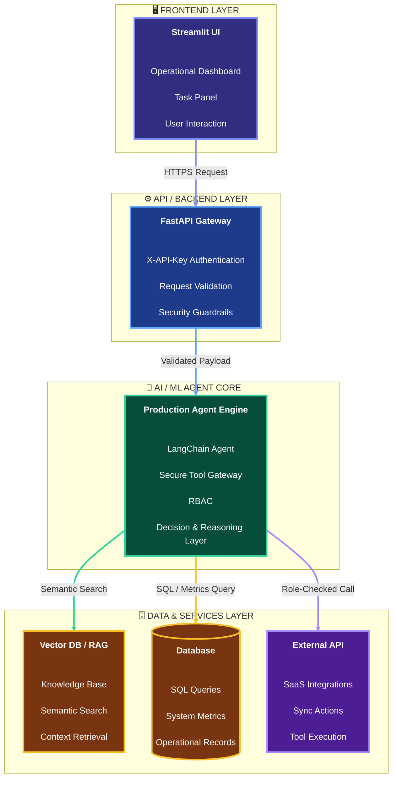

# AI Business Operations Agent Platform

An enterprise-grade autonomous workflow system featuring a secure tool gateway, role-based access control (RBAC), and robust security guardrails for AI-driven business operations.


## 🏗️ System Architecture
The platform follows a decoupled, secure client-server architecture separating the Streamlit operational frontend from the FastAPI backend engine, protected by a strict middleware security layer.



## 🚀 Key Components
* **Production Agent Engine** (`backend/core/engine.py`): Drives the autonomous reasoning loop (Plan \(\rightarrow\) Execute \(\rightarrow\) Evaluate \(\rightarrow\) Complete) with dynamic tool routing based on user intent.
* **Secure Tool Gateway** (`backend/core/gateway.py`): Acts as an interception layer enforcing Role-Based Access Control (RBAC) to restrict unauthorized WRITE or sensitive operations.
* **Security Guardrails** (`backend/core/guardrails.py`): Scans incoming prompts for potential prompt injections and sanitizes outgoing responses for data safety.
* **Interactive Operations UI** (`frontend/app.py`): A Streamlit-powered control panel offering task execution, live system metrics monitoring, and structured executive summary outputs.

## 💻 Technology Stack

Here is the complete technology stack used to build this enterprise-grade AI Business Operations Agent Platform:

* **Frontend:** Streamlit (Python) for building the interactive operational dashboard, configuration panel, and task execution interface.
* **Backend & API:** FastAPI for high-performance asynchronous API endpoints, routing, and header-based authentication (`X-API-Key`).
* **AI & Agent Core:** Custom Python-based Production Agent Engine implementing autonomous reasoning loops (Plan \(\rightarrow\) Execute \(\rightarrow\) Evaluate \(\rightarrow\) Complete) and dynamic tool routing.
* **Security & Governance:** Secure Tool Gateway enforcing Role-Based Access Control (RBAC) (`standard_agent` vs `restricted_agent`) and Security Guardrails for prompt injection defense and input sanitization.
* **Data & Services:** Vector Search / RAG knowledge base and PostgreSQL / Mock database for system metrics and operational records.
* **Deployment & DevOps:** Docker containerization, Git & GitHub version control, and Render cloud hosting.

## 📁 Project Directory Structure
```text
ai-ops-agent-platform/
│
├── backend/
│   ├── agents/
│   │   ├── graphs/
│   │   ├── __init__.py
│   │   └── base_agent.py
│   ├── api/
│   │   └── v1/
│   │       ├── __init__.py
│   │       ├── agent.py
│   │       ├── auth.py
│   │       └── health.py
│   ├── core/
│   │   ├── __init__.py
│   │   ├── engine.py
│   │   ├── gateway.py
│   │   └── guardrails.py
│   ├── database/
│   │   ├── __init__.py
│   │   ├── models.py
│   │   └── session.py
│   ├── memory/
│   │   ├── __init__.py
│   │   ├── redis_cache.py
│   │   └── vector_db.py
│   ├── tools/
│   │   ├── __init__.py
│   │   ├── api_tool.py
│   │   ├── db_tool.py
│   │   ├── rag_tool.py
│   │   └── registry.py
│   ├── workers/
│   │   ├── __init__.py
│   │   └── queue_worker.py
│   ├── __init__.py
│   ├── config.py
│   └── main.py
│
├── frontend/
│   ├── components/
│   │   ├── chat_box.py
│   │   ├── dashboard.py
│   │   └── hitl_panel.py
│   ├── utils/
│   │   ├── __init__.py
│   │   └── api_client.py
│   └── app.py
│
├── tests/
│   ├── __init__.py
│   ├── test_engine.py
│   ├── test_guardrails.py
│   └── test_tools.py
│
├── .env
├── .gitignore
├── docker-compose.yml
├── Dockerfile
├── README.md
└── requirements.txt
```

## 🛠️ Engineering Challenges & Solutions

1. **Challenge: Unauthorized Tool Execution & Security Risks**
   * **The Problem:** Autonomous agents can sometimes be tricked into executing destructive write or external sync operations if proper authorization checks are missing.
   * **The Solution:** Implemented a **Secure Tool Gateway** backed by strict **RBAC**. Agents must pass through a role validation check (`standard_agent` vs `restricted_agent`) before any tool execution, automatically blocking unauthorized write requests.

2. **Challenge: Prompt Injection & Malicious Inputs**
   * **The Problem:** Users attempting to bypass system rules using adversarial prompt injections ("Ignore previous instructions...").
   * **The Solution:** Integrated a dedicated **Security Guardrails** layer at the entry point of the FastAPI pipeline that filters and blocks malicious injection payloads prior to reaching the agent engine.

3. **Challenge: Rigid Single-Tool Routing**
   * **The Problem:** Early iterations routed every user goal strictly to a single vector search tool, limiting operational flexibility.
   * **The Solution:** Built a dynamic intent-parsing engine (`_generate_plan`) that analyzes user goal keywords and intelligently routes execution paths between Vector Search, Database Lookups, and External API Sync tools.
  
## ⚙️ Local Installation & Setup

1. **Configure Environment Variables:**
   
   Create a .env file in the root directory and set your keys:
   ```bash
   GEMINI_API_KEY=your_gemini_api_key_here
   X_API_KEY=dev_token_123
   DATABASE_URL=sqlite:///./app.db
   ```
2. **Clone the Repository:**
   ```bash
   git clone https://github.com/subair247/AgenticOps-Enterprise-AI-Business-Operations-Secure-Tool-Gateway-Engine.git
   cd ai-ops-agent-platform
   ```
3. **Install Dependencies:**
   ```Bash
   pip install -r requirements.txt
   ```
4. **Run FastAPI Backend:**
   ```bash
   uvicorn backend.main:app --reload --port 8000
   ```
5. **Run Streamlit Frontend (in a separate terminal):**
   ```bash
   streamlit run frontend/app.py
   ```

## 📚 API Documentation & Testing

Once the FastAPI backend is running (`http://localhost:8000`), you can access the interactive Swagger documentation and test endpoints directly at:

* **Swagger UI:** [http://localhost:8000/docs](http://localhost:8000/docs)
* **ReDoc:** [http://localhost:8000/redoc](http://localhost:8000/redoc)

## ☁️ Deployment (Render)

1. Push your repository to GitHub.
2. Create a new **Web Service** on Render and select **Docker**.
3. Configure environment variables in the Render dashboard (`GEMINI_API_KEY`, `DATABASE_URL`, `X_API_KEY`).
4. Deploy!